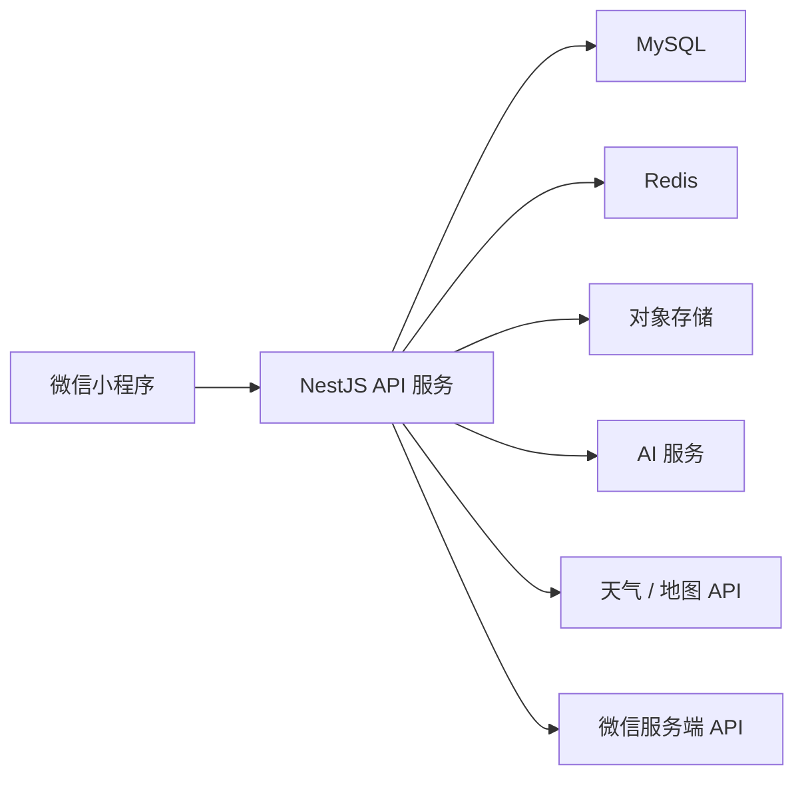

# 技术方案与数据模型

## 1. 技术选型建议

### 前端

推荐：微信小程序原生。

理由：

- 第一目标是微信小程序，上线链路更直接。
- 微信登录、订阅消息、位置授权、图片上传等能力更贴近原生生态。
- 第一版功能较多，先减少跨端框架复杂度。

如果未来明确要同时做 App / H5，可以改用 uni-app。

### 后端

推荐：

- Node.js + NestJS
- MySQL
- Redis
- 对象存储：腾讯云 COS / 阿里云 OSS

### AI 服务

可选：

- OpenAI
- DeepSeek
- 通义千问
- 豆包

AI 用途：

- 情绪分析
- 安慰文案
- 天气建议生成
- 经期建议生成
- 心愿总结
- 男朋友话术生成
- OOTD 推荐

### 第三方服务

需要：

- 微信登录
- 微信订阅消息
- 天气 API
- 地图定位 API
- 对象存储
- AI API

天气服务可选：

- 和风天气
- 高德天气
- 腾讯位置服务

## 2. 系统架构



## 3. 核心数据表

### users

用户表。

| 字段 | 类型 | 说明 |
| --- | --- | --- |
| id | bigint | 主键 |
| openid | varchar(128) | 微信 openid |
| unionid | varchar(128) | 微信 unionid，可选 |
| nickname | varchar(64) | 昵称 |
| avatar | varchar(512) | 头像 |
| birthday | date | 生日 |
| gender | varchar(20) | 性别 |
| role | varchar(20) | wai_bao / boyfriend |
| phone | varchar(32) | 手机号，可选 |
| preferred_name | varchar(64) | 喜欢的称呼 |
| comfort_preference | varchar(255) | 喜欢的安慰方式 |
| dislike_expression | varchar(255) | 不喜欢的表达方式 |
| created_at | datetime | 创建时间 |
| updated_at | datetime | 更新时间 |

### couples

情侣绑定表。

| 字段 | 类型 | 说明 |
| --- | --- | --- |
| id | bigint | 主键 |
| user_id | bigint | 歪宝用户 ID |
| partner_id | bigint | 男朋友用户 ID |
| love_start_date | date | 恋爱开始日期 |
| bind_code | varchar(32) | 绑定邀请码 |
| bind_code_expired_at | datetime | 邀请码过期时间 |
| status | varchar(20) | pending / active / unbound |
| created_at | datetime | 创建时间 |
| updated_at | datetime | 更新时间 |

### user_privacy_settings

隐私设置表。

| 字段 | 类型 | 说明 |
| --- | --- | --- |
| id | bigint | 主键 |
| user_id | bigint | 用户 ID |
| allow_wish_view | boolean | 是否允许查看心愿 |
| allow_emotion_notify | boolean | 是否允许情绪提醒 |
| allow_period_notify | boolean | 是否允许经期提醒 |
| allow_mood_view | boolean | 是否允许查看今日心情 |
| created_at | datetime | 创建时间 |
| updated_at | datetime | 更新时间 |

### important_dates

重要日期表。

| 字段 | 类型 | 说明 |
| --- | --- | --- |
| id | bigint | 主键 |
| user_id | bigint | 创建者 ID |
| couple_id | bigint | 情侣关系 ID，可选 |
| title | varchar(128) | 日期名称 |
| date | date | 日期 |
| repeat_type | varchar(20) | none / yearly |
| remind_days_before | int | 提前几天提醒 |
| show_on_home | boolean | 是否首页展示 |
| remind_partner | boolean | 是否提醒男朋友 |
| created_at | datetime | 创建时间 |
| updated_at | datetime | 更新时间 |

### diaries

日记表。

| 字段 | 类型 | 说明 |
| --- | --- | --- |
| id | bigint | 主键 |
| user_id | bigint | 用户 ID |
| content | text | 日记内容 |
| mood_score | int | 用户自评心情分 |
| ai_comfort_text | text | AI 安慰文案 |
| emotion_level | int | 情绪等级 0 - 4 |
| emotion_type | varchar(64) | 情绪类型 |
| notify_partner | boolean | 是否建议提醒伴侣 |
| created_at | datetime | 创建时间 |
| updated_at | datetime | 更新时间 |

### weather_records

天气记录表。

| 字段 | 类型 | 说明 |
| --- | --- | --- |
| id | bigint | 主键 |
| user_id | bigint | 用户 ID |
| city | varchar(64) | 城市 |
| temperature_min | int | 最低温 |
| temperature_max | int | 最高温 |
| weather | varchar(64) | 天气 |
| rain_probability | int | 降雨概率 |
| clothing_advice | varchar(255) | 穿衣建议 |
| skincare_advice | varchar(255) | 护肤建议 |
| created_at | datetime | 创建时间 |

### period_records

经期记录表。

| 字段 | 类型 | 说明 |
| --- | --- | --- |
| id | bigint | 主键 |
| user_id | bigint | 用户 ID |
| start_date | date | 开始日期 |
| end_date | date | 结束日期 |
| pain_level | varchar(20) | none / mild / medium / severe |
| flow_level | varchar(20) | low / normal / high |
| mood | varchar(20) | normal / angry / sad / anxious |
| note | text | 备注 |
| created_at | datetime | 创建时间 |
| updated_at | datetime | 更新时间 |

### todos

待办表。

| 字段 | 类型 | 说明 |
| --- | --- | --- |
| id | bigint | 主键 |
| user_id | bigint | 用户 ID |
| title | varchar(128) | 标题 |
| due_date | datetime | 截止时间 |
| priority | varchar(20) | low / normal / high |
| status | varchar(20) | pending / done / archived |
| repeat_type | varchar(20) | none / daily / weekly / monthly |
| created_at | datetime | 创建时间 |
| updated_at | datetime | 更新时间 |

### wishes

心愿表。

| 字段 | 类型 | 说明 |
| --- | --- | --- |
| id | bigint | 主键 |
| user_id | bigint | 创建者 ID |
| title | varchar(128) | 心愿标题 |
| description | text | 描述 |
| image_url | varchar(512) | 图片 |
| category | varchar(64) | 分类 |
| priority | varchar(20) | 优先级 |
| progress | int | 完成进度 0 - 100 |
| status | varchar(20) | wanted / claimed / preparing / done / archived |
| claimed_by | bigint | 认领人 ID |
| created_at | datetime | 创建时间 |
| updated_at | datetime | 更新时间 |

### wardrobe_items

衣橱表。

| 字段 | 类型 | 说明 |
| --- | --- | --- |
| id | bigint | 主键 |
| user_id | bigint | 用户 ID |
| image_url | varchar(512) | 图片 |
| type | varchar(64) | 类型 |
| color | varchar(64) | 颜色 |
| style | varchar(64) | 风格 |
| season | varchar(64) | 季节 |
| created_at | datetime | 创建时间 |
| updated_at | datetime | 更新时间 |

### notifications

推送记录表。

| 字段 | 类型 | 说明 |
| --- | --- | --- |
| id | bigint | 主键 |
| user_id | bigint | 发起用户 ID |
| target_user_id | bigint | 接收用户 ID |
| type | varchar(64) | 类型 |
| content | text | 内容 |
| status | varchar(20) | pending / sent / failed / read |
| created_at | datetime | 创建时间 |
| updated_at | datetime | 更新时间 |

## 4. API 草案

### 认证

- `POST /auth/wechat-login` 微信登录
- `GET /me` 获取当前用户
- `PATCH /me/profile` 更新个人资料

### 情侣绑定

- `POST /couples/bind-code` 生成邀请码
- `POST /couples/bind` 输入邀请码绑定
- `GET /couples/current` 获取当前绑定关系
- `POST /couples/unbind` 解除绑定

### 首页

- `GET /home/today` 获取今日首页聚合数据
- `GET /home/boyfriend` 获取男朋友端首页聚合数据

### 重要日子

- `GET /important-dates`
- `POST /important-dates`
- `PATCH /important-dates/:id`
- `DELETE /important-dates/:id`

### 日记与 AI

- `GET /diaries`
- `POST /diaries`
- `GET /diaries/:id`
- `POST /diaries/:id/analyze`

### 待办

- `GET /todos?date=YYYY-MM-DD`
- `POST /todos`
- `PATCH /todos/:id`
- `POST /todos/:id/complete`
- `DELETE /todos/:id`

### 心愿

- `GET /wishes`
- `POST /wishes`
- `PATCH /wishes/:id`
- `POST /wishes/:id/claim`
- `POST /wishes/:id/progress`
- `POST /wishes/:id/archive`

### 天气

- `GET /weather/today`
- `GET /weather/forecast`
- `POST /weather/city`

### 例假

- `GET /period-records`
- `POST /period-records`
- `PATCH /period-records/:id`
- `DELETE /period-records/:id`

### 隐私设置

- `GET /privacy-settings`
- `PATCH /privacy-settings`

### 通知

- `GET /notifications`
- `POST /notifications/:id/read`

## 5. 首页聚合数据示例

`GET /home/today`

```json
{
  "greeting": "下午好，歪宝",
  "encouragement": "加油，你是最棒的小宝宝！",
  "love_days": 520,
  "important_dates": [
    {
      "title": "歪宝生日",
      "days_left": 7,
      "is_today": false
    }
  ],
  "weather": {
    "city": "上海",
    "temperature_min": 18,
    "temperature_max": 25,
    "weather": "小雨",
    "summary": "可能有小雨，记得带伞，建议穿薄外套。"
  },
  "todos": [
    {
      "id": 1,
      "title": "喝水",
      "status": "pending"
    }
  ],
  "today_diary": {
    "exists": true,
    "emotion_level": 2,
    "comfort_text": "今天已经很努力啦，先抱抱自己。"
  }
}
```

## 6. 权限与隐私

关键规则：

- 日记全文默认只属于本人。
- 男朋友端不展示完整日记内容。
- 情绪提醒必须经过用户授权。
- 经期提醒必须单独开关。
- 心愿共享必须可关闭。
- 每一次对伴侣的提醒都要记录，便于用户追溯。

## 7. 风险点

- 情绪分析不能替代心理咨询或医疗建议。
- 经期记录不能作为医疗诊断依据。
- 情绪提醒容易被误解为监控，文案必须克制。
- AI 文案需要做好安全兜底，避免输出刺激性内容。
- 订阅消息需要用户授权，不能假设一定能推送成功。
