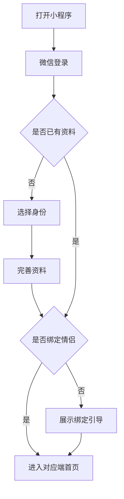
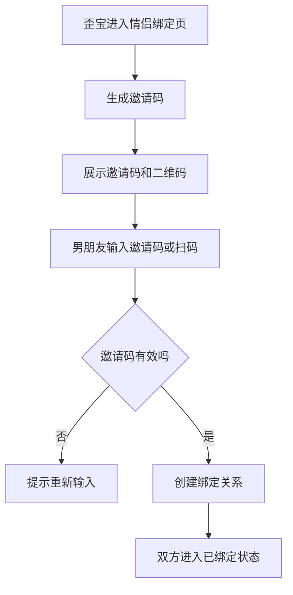
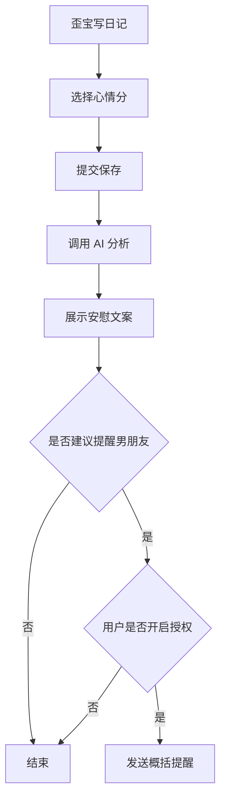
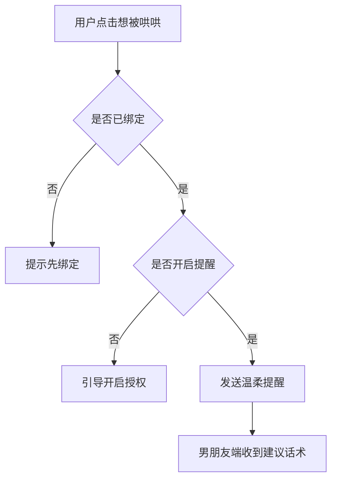
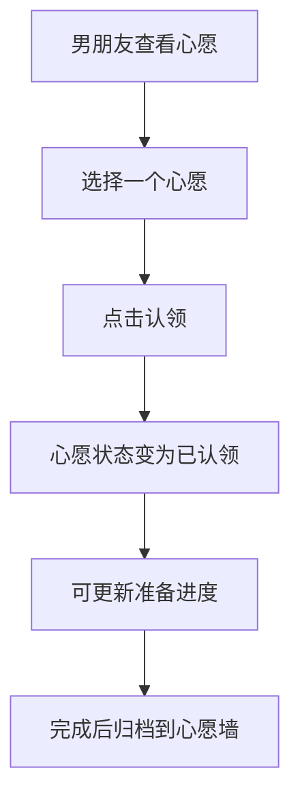

# 首版页面与交互流

## 1. 设计方向

关键词：

- 温柔
- 轻盈
- 有陪伴感
- 不幼稚
- 不打扰

视觉建议：

- 主色：温暖粉 / 珊瑚色，用于强调和行动按钮。
- 辅色：浅绿、浅蓝、淡黄，用于天气、待办、心愿等状态区分。
- 背景：接近白色的暖色背景。
- 卡片：圆角不宜过大，8 - 12px 即可。
- 文案：少解释功能，多给情绪回应。

## 2. 首次进入流程

身份选择：

- 我是歪宝
- 我是男朋友

歪宝资料必填：

- 昵称
- 喜欢的称呼
- 生日，可跳过
- 恋爱开始日期，可跳过

男朋友资料必填：

- 昵称
- 头像，可默认

## 3. 歪宝端页面

### 3.1 今日页

路由建议：`/pages/today/index`

页面结构：

1. 顶部问候
2. 恋爱天数
3. 重要日子
4. 天气简报
5. 今日待办
6. 今日心情入口
7. AI 安慰结果

关键状态：

- 未登录：展示登录按钮。
- 未完善资料：展示资料补全入口。
- 未绑定：展示邀请码生成入口，不阻塞其他功能。
- 无日记：展示“写写今天”的入口。
- 有日记：展示 AI 安慰摘要。
- AI 分析中：展示轻量加载态。
- AI 失败：展示兜底安慰文案。

今日页文案示例：

- 下午好，歪宝
- 今天也慢慢来就好
- 我们已经恋爱 520 天啦
- 写写今天发生了什么
- 想被哄哄

### 3.2 天气页

路由建议：`/pages/weather/index`

MVP 内容：

- 当前城市
- 今日天气
- 温度区间
- 降雨提醒
- 穿衣建议
- 护肤建议
- 三日预报简版

状态：

- 无定位权限：引导手动选择城市。
- 天气加载失败：展示缓存天气或温柔降级文案。

### 3.3 心愿页

路由建议：`/pages/wishes/index`

页面结构：

- 心愿筛选：全部 / 想要中 / 已认领 / 准备中 / 已完成
- 心愿列表
- 新增心愿按钮

心愿卡片信息：

- 图片
- 标题
- 分类
- 优先级
- 进度
- 状态

新增心愿页：`/pages/wishes/edit`

字段：

- 标题
- 描述
- 图片
- 分类
- 优先级

### 3.4 我的 / 宝宝页

路由建议：`/pages/profile/index`

页面入口：

- 个人资料
- 情侣绑定
- 重要日子
- 隐私设置
- 通知设置
- 关于与免责声明

## 4. 男朋友端页面

### 4.1 今日页

路由建议：`/pages/boyfriend/today`

页面结构：

1. 歪宝今日状态
2. 今日建议
3. 重要日子
4. 最近心愿
5. 一键哄哄入口

展示原则：

- 只展示概括状态。
- 不展示日记全文。
- 经期信息必须用户授权才展示。

示例：

- 歪宝今天可能有点累
- 今天适合多夸夸她
- 距离她生日还有 7 天
- 最近心愿：想吃火锅

### 4.2 心愿页

路由建议：`/pages/boyfriend/wishes`

功能：

- 查看允许共享的心愿
- 认领心愿
- 更新进度
- 标记完成

### 4.3 哄哄页

路由建议：`/pages/boyfriend/comfort`

功能：

- 一键生成关心文案
- 复制文案
- 发送关心消息
- 根据状态生成不同语气

文案：

- 抱抱歪宝，今天辛苦啦。
- 不开心可以慢慢说，我一直都在。
- 今天不想努力也没关系，我陪你。

### 4.4 我的页

路由建议：`/pages/boyfriend/profile`

入口：

- 绑定信息
- 纪念日
- 通知设置
- 关于

## 5. 关键交互流

### 5.1 情侣绑定

规则：

- 邀请码建议 10 - 30 分钟有效。
- 绑定成功后旧邀请码失效。
- 解除绑定需要二次确认。

### 5.2 写日记与 AI 安慰

规则：

- 先保存日记，再调用 AI。
- AI 失败不影响日记保存。
- 伴侣提醒不包含日记原文。

### 5.3 想被哄哄

### 5.4 心愿认领

## 6. MVP 组件清单

通用组件：

- 顶部问候组件
- 首页卡片组件
- 空状态组件
- 加载状态组件
- 情绪标签
- 重要日子倒计时
- 心愿卡片
- 待办项
- 隐私开关项

表单组件：

- 日期选择
- 心情评分
- 图片上传
- 分类选择
- 优先级选择
- 进度选择

反馈组件：

- 完成鼓励弹窗
- AI 安慰卡片
- 绑定成功提示
- 推送授权提示

## 7. 首版不做的界面

- 社区信息流
- 大型数据报表
- 数字人试穿
- 复杂穿搭编辑器
- 会员中心
- 过多动画
